## Introduction

[MaixHub](https://maixhub.com/) provides online AI model training. You can collect data, upload images, annotate images, train models, and deploy models in a browser without setting up a local training environment or configuring a GPU.

This page follows the official example video workflow and uses an **image detection model** as the example. If you only want to try AI features quickly, first check the [MaixHub Model Zoo](https://maixhub.com/model/zoo) to see whether a ready-to-use model already exists. Use online training when you need to recognize custom targets.

> The screenshots below are for workflow guidance. Account, project, dataset, image file names, QR codes, and training task IDs have been blurred.

## Official Video Demos

MaixHub provides two official videos on the home page. Watch **Quick Start** first to understand the overall online training workflow. When you need to follow the page step by step, watch **Tutorial** as a detailed walkthrough. After logging in to [MaixHub](https://maixhub.com/), click **Play Video** in the video area at the top of the home page to watch.

## MaixHub Model Training Workflow

This section keeps the complete tutorial in one workflow category and follows the actual operation order: create a project, prepare data, annotate images, train the model, and deploy it.

| Step | Operation |
| --- | --- |
| Create a project | Select the model type and target hardware platform |
| Prepare a dataset | Upload training and validation images from the device or local files |
| Annotate images | Detection models require boxes for each target |
| Create a training task | Select the model, augmentation, and training parameters |
| Check training results | Review curves and validation examples |
| Deploy to device | Download the model package and upload it to the device with MaixVision |

### Create a Training Project

From the MaixHub home page, enter **Model Training** and create a new training project. Select the model type and hardware platform during project creation:

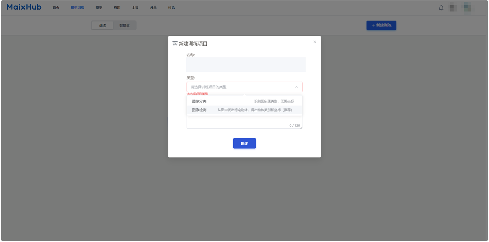

This guide uses an **image detection model** in the following steps. It is suitable when the model needs to locate target positions in an image.

After the project is created, follow the left navigation to complete dataset preparation, annotation, training, and deployment.

### Prepare the Dataset

Create a dataset after entering the project. The data type and annotation type must match the project. For example, a detection project should use image data and detection annotation.

It is recommended to collect images with the MaixHub app on the device. Device-captured images are closer to the real camera angle, resolution, and lighting used during deployment, so the trained model is more likely to run reliably on the device.

On the web page, open **Collect Data**, choose whether the images should go to the training set or validation set, and generate a QR code:

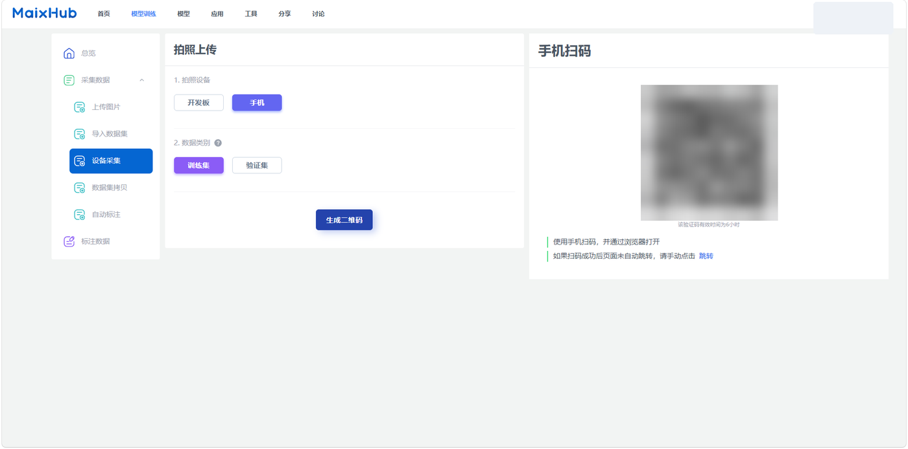

Basic workflow:

1. Make sure the device is connected to WiFi.
2. Create and select a dataset on the web page.
3. Choose the training set or validation set, then generate the QR code.
4. Open the MaixHub app on the device, scan the QR code, and upload captured images.

The training set is used for learning target features, while the validation set is used for evaluating training quality. For detection models, keep at least 5 validation images for each label, otherwise training may not start. The validation set should not duplicate the training set and should use real-scene images whenever possible.

In the dataset page, select images in batches and move them to the training set or validation set as needed:

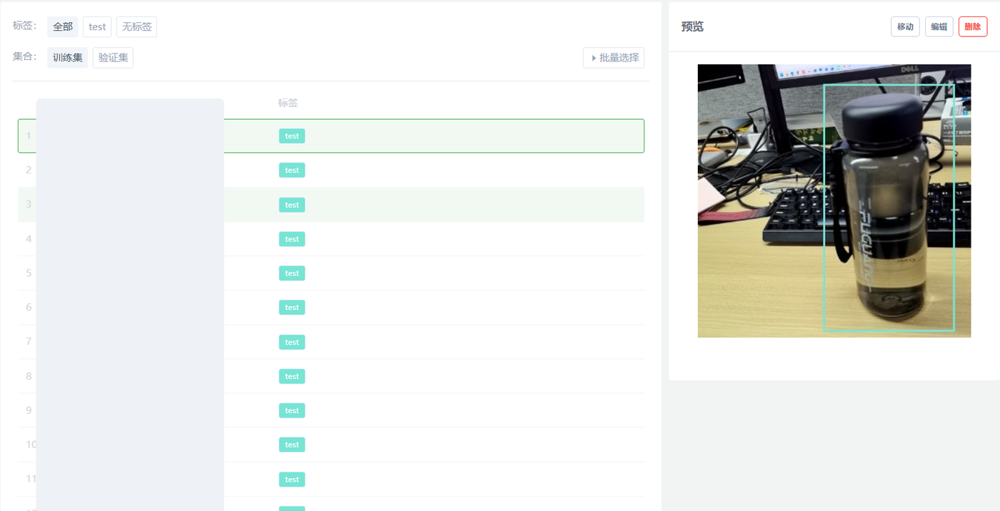

### Annotate Data

Image classification only requires selecting a category for each image. Image detection requires drawing boxes for targets and assigning labels to those boxes.

Open **Annotate Data**, create annotations, draw target boxes, and save the result:

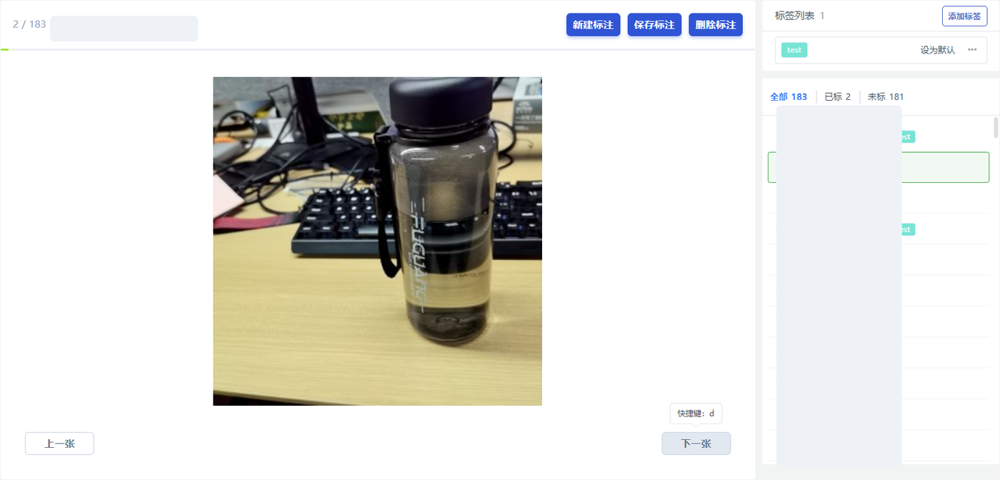

Annotation tips:

* Keep each box close to the target object and avoid including too much background.
* Use consistent annotation rules for the same target class.
* Do not miss targets that should be detected.
* Leave blurry, heavily occluded, or uncertain images out of the training set first.

For larger datasets, complete one full training and deployment cycle with a small dataset first, then gradually add more data to improve results.

### Create a Training Task

After checking the dataset and annotations, open **Create Task**. The page mainly contains image augmentation, model selection, and training parameter panels:

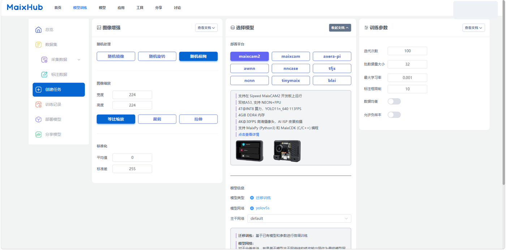

Beginners can use the table below first, complete one full workflow, then adjust settings based on the actual result:

| Page option | Beginner choice | When to adjust |
| --- | --- | --- |
| Deployment platform | Select the actual device, such as MaixCAM or MaixCAM2 | Change it only when the target hardware changes |
| Model network | Keep the default recommended option | Try another network only when the default speed or accuracy is not acceptable |
| Image augmentation | Keep the default settings first | Increase augmentation when lighting or viewing angles vary greatly in the real scene |
| Data balancing | Enable it when class image counts differ greatly | Keep it disabled when each class has a similar number of images |
| Negative samples | Add images without targets when background false positives appear | Leave it unchanged if there are no obvious false positives |

After confirming the model information and parameters, click **Create Training Task**, enter a task name, and start training.

### Check Training Results

After training starts, open **Training Records** to view progress, logs, dataset statistics, and training parameters. When training is complete, the result page shows loss curves, accuracy curves, and validation examples:

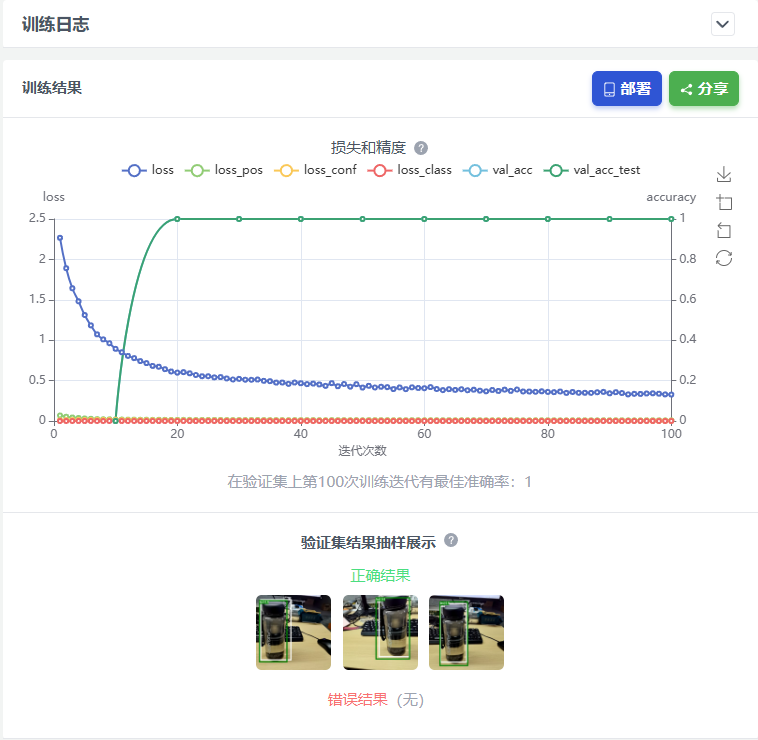

Check the following first:

* Whether the curves are stable and free of obvious anomalies.
* Whether the validation examples are recognized correctly.
* Whether wrong results are concentrated under certain angles, lighting conditions, or backgrounds.

If training fails, check the log on the right first. In the example below, the failure is caused by fewer than 5 validation images for one label. Return to the dataset page, add enough validation images, and create a new training task.

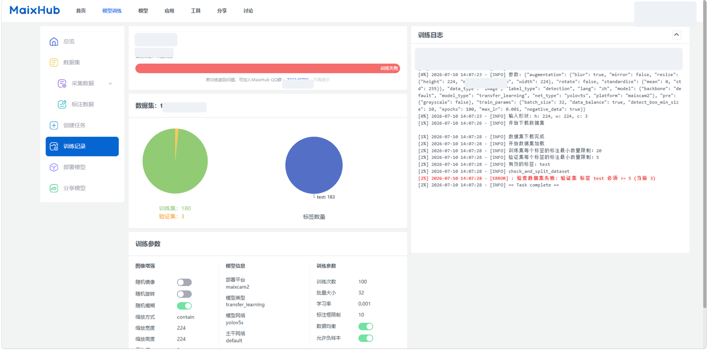

### Deploy to MaixCAM / MaixCAM-Pro / MaixCAM2

After training is complete and the validation result is acceptable, open the project deployment page and select the training record to deploy. Choose **Manual Deployment**, then click **Download Model** to download the model package.

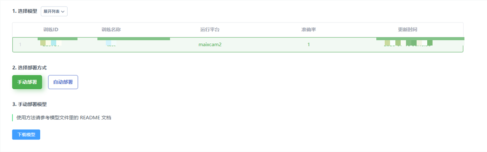

Unzip the downloaded package first. Different device platforms generate different model file extensions. For manual deployment, upload the files that match the target device:

| Device platform | Model files to upload | Notes |
| --- | --- | --- |
| MaixCAM / MaixCAM-Pro | `model_xxx.mud` and the corresponding `.cvimodel` file | The `.mud` file records the model type, labels, and `.cvimodel` file name |
| MaixCAM2 | `model_xxx.mud`, `model_xxx_npu.axmodel`, and `model_xxx_vnpu.axmodel` | The two `.axmodel` files are used for normal NPU mode and AI-ISP reserved-NPU mode |

The unzipped folder usually also contains `main.py`, `app.yaml`, and `report.json`. `main.py` can be used as the example program reference, `app.yaml` can be used as an app configuration reference, and `report.json` can be used to check training and export information.

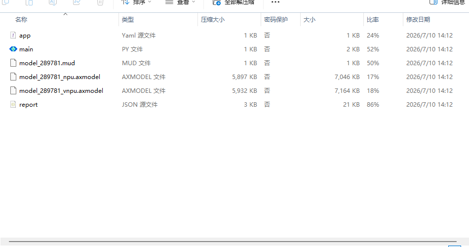

Open MaixVision and connect to the device. Open **Device File Manager** on the left, then enter `/root/models` on the device. This directory is used to store model files.

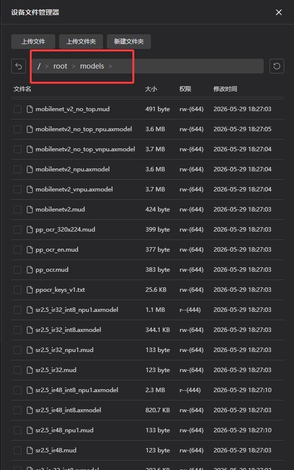

Click **Upload File** in MaixVision, select the model files for the target device from the unzipped folder, and upload them to `/root/models` on the device. For MaixCAM / MaixCAM-Pro, upload the `.mud` and `.cvimodel` files. For MaixCAM2, upload the `.mud` file and the corresponding two `.axmodel` files.

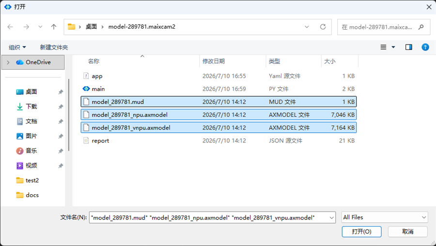

After uploading, run the example program first:

1. Open `main.py` from the unzipped folder on your computer and check whether the model path in the code points to `/root/models/model_xxx.mud`. If the file name is different, replace it with the actual `.mud` file name uploaded to the device.
2. Open this `main.py` in MaixVision and make sure the device is connected.
3. Click Run and point the camera at the trained target. If detection boxes and confidence values appear on the screen or preview window, the model is running on the device.
4. If no detection box appears, first confirm that the `.mud` file and the corresponding model files have been uploaded to `/root/models` (`.cvimodel` for MaixCAM / MaixCAM-Pro, `.axmodel` for MaixCAM2), then return to the training result page and check the validation result.

To integrate the model into your own project, replace the model path in your code with `/root/models/model_xxx.mud`, and follow the detection code structure in [YOLO object detection](./yolov5.md) to read from the camera, run detection, and display the result. After integration, test again in the real scene and check the detection box position, confidence, and false detections.

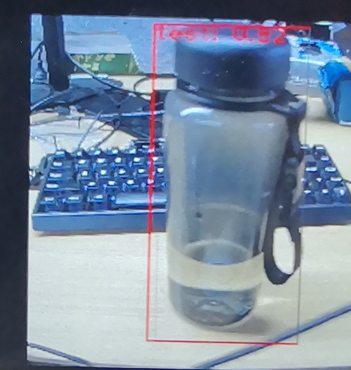
