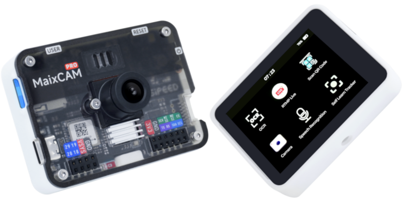

---
title: MaixCAM MaixPy 快速开始
---

| 资源汇总                    | 链接                                                                                      |
| :-------------------------: | :-------------------------------------------------------------------------------------:|
|  MaixPy 教程文档 📖         | [wiki.sipeed.com/maixpy](https://wiki.sipeed.com/maixpy)                                   |
| MaixPy 例程和源码            | [github.com/sipeed/MaixPy](https://github.com/sipeed/MaixPy)                               |
|  MaixCAM 硬件资料 📷        | [wiki.sipeed.com/maixcam](https://wiki.sipeed.com/maixcam)   [wiki.sipeed.com/maixcam-pro](https://wiki.sipeed.com/maixcam-pro)     [wiki.sipeed.com/maixcam2](https://wiki.sipeed.com/maixcam2)                             |
|  MaixPy API 文档 📚        | [wiki.sipeed.com/maixpy/api/](https://wiki.sipeed.com/maixpy/api/index.html)               |
| MaixPy 视频和教程 💿        | [B站搜 MaixCAM 或 MaixPy](https://search.bilibili.com/all?keyword=maixcam&from_source=webtop_search&spm_id_from=333.1007&search_source=5) |
| MaixHub 应用商店 📦     | [maixhub.com/app](https://maixhub.com/app)                                                 |
| MaixHub 分享广场 🎲       | [maixhub.com/share](https://maixhub.com/share)                                             |
| 开源项目 📡             | GitHub 搜：[MaixCAM](https://github.com/search?q=maixcam&type=repositoriese) / [MaixCAM2](https://github.com/search?q=maixcam2&type=repositoriese) / [MaixPy](https://github.com/search?q=maixpy&type=repositoriese)  |

  

    <a target="_blank" style="color: white; font-size: 0.9em; border-radius: 0.3em; padding: 0.5em; background-color: #c33d45" href="https://item.taobao.com/item.htm?id=784724795837">淘宝(MaixCAM)</a>
    <a target="_blank" style="color: white; font-size: 0.9em; border-radius: 0.3em; padding: 0.5em; background-color: #c33d45" href="https://item.taobao.com/item.htm?id=846226367137">淘宝(MaixCAM-Pro)</a>
    <a target="_blank" style="color: white; font-size: 0.9em; border-radius: 0.3em; padding: 0.5em; background-color: #c33d45" href="https://www.aliexpress.com/store/911876460">速卖通</a>
  

 

> 关于 MaixPy 介绍请看 [MaixPy 官网首页](../../README.md)
> 喜欢 MaixPy 请给 [ MaixPy 项目](https://github.com/sipeed/MaixPy) 点个 Star ⭐️ 以鼓励我们开发更多功能。

## 先选择你的设备

MaixCAM 系列型号较多，如果你是第一次使用，先看包装、订单名称或者设备外壳上的型号，再进入对应的上手文档。找对型号后再继续往下看视频和教程，可以少走很多弯路。

| 设备型号 | 产品图 | 上手文档 |
| --- | --- | --- |
| MaixCAM2 |  | [快速开始 MaixCAM2](./README_MaixCAM2.md) |
| MaixCAM / MaixCAM-Pro |  | [快速开始 MaixCAM](./README_MaixCAM.md) |
| MaixCAM Lite / 无屏幕版本 |  | [快速开始 MaixCAM 无屏幕版本](./README_no_screen.md) |

## 写在前面

* 请**仔细**阅读按照下面文档的步骤，不要遗漏内容，对比进行操作。
* **左边目录**请仔细查看，基础部分一定要耐心阅读完。
* **提问前**先在左边目录仔细查找文档，以及看[FAQ](./faq.md)。
* 本文档是`MaixPy v4 教程文档`，注意与 [MaixPy-v1](https://wiki.sipeed.com/soft/maixpy/zh/index.html)（k210系列）区别开，勿错看文档。
* 也可以参考下面的视频上手教程，注意视频内容有更正在**评论区和弹幕会补充，以最新的文档为准**。更多视频教程可从 [B站搜索 MaixCAM 或 MaixPy](https://search.bilibili.com/all?keyword=maixcam) 查看。
<iframe src="//player.bilibili.com/player.html?isOutside=true&aid=112865415531014&bvid=BV1vcvweCEEe&cid=500001630687957&p=1" scrolling="no" border="0" frameborder="no" framespacing="0" allowfullscreen="true" style="min-height:20em; width: 90%"></iframe>

## 获得 MaixCAM/MaixCAM2 设备

基础资料:[MaixCAM2 介绍和资料](https://wiki.sipeed.com/hardware/zh/maixcam/maixcam2.html)
购买链接:[Sipeed 淘宝](https://item.taobao.com/item.htm?id=846226367137) 或者 [Sipeed 速卖通](https://www.aliexpress.com/store/911876460)
 

**MaixCAM**目前有几个版本，根据自己的需求买：

| | |
|---|---|
|**MaixCAM-Pro**（推荐）|基础资料:[MaixCAM-Pro 介绍和资料](https://wiki.sipeed.com/maixcam-pro) 购买链接:[Sipeed 淘宝](https://item.taobao.com/item.htm?id=846226367137) 或者 [Sipeed 速卖通](https://www.aliexpress.com/store/911876460)|
|**MaixCAM**|基础资料:[MaixCAM 介绍和资料](https://wiki.sipeed.com/maixcam) 购买链接:[Sipeed 淘宝](https://item.taobao.com/item.htm?id=784724795837) 或者 [Sipeed 速卖通](https://www.aliexpress.com/store/911876460)|
|**MaixCAM-Lite**（不推荐）|无屏幕和外壳版本，价格更便宜，学习开发不建议购买，量产可以考虑购买。|

 

>! 注意，目前只支持 MaixCAM 系列开发板，其它同型号芯片的开发板均不支持，包括 Sipeed 的同型号芯片开发板，请注意不要买错造成不必要的时间和金钱浪费。

## 下一步

看到这里，如果你觉得不错，**请务必来 [github](https://github.com/sipeed/MaixPy) 给 MaixPy 开源项目点一个 star（需要先登录 github）, 你的 star 和认同是我们不断维护和添加新功能的动力！**

到这里你已经体验了一遍使用和开发流程了，接下来可以学习 `MaixPy` 语法和功能相关的内容，请按照左边的目录进行学习，如果遇到 `API` 使用问题，可以在[API 文档](/api/)中查找。

学习前最好带着自己学习的目的学，比如做一个有趣的小项目，这样学习效果会更好，项目和经验都可以分享到[MaixHub 分享广场](https://maixhub.com/share)，会获得现金奖励哦！

## 常见问题 FAQ

遇到问题可以优先在 [FAQ](./faq.md) 里面找，找不到再在下面的论坛或者群询问，或者在 [MaixPy issue](https://github.com/sipeed/MaixPy/issues) 提交源码问题。

## 分享交流

* **[MaixHub 项目和经验分享](https://maixhub.com/share)** ：分享你的项目和经验，获得现金打赏，获得官方打赏的基本要求：
  * **可复现型**：较为完整的项目制作复现过程。
  * **炫耀型**：无详细的项目复现过程，但是项目展示效果吸引人。
  * Bug 解决经验型：解决了某个难题的过程和具体解决方法分享。
* [MaixPy 官方论坛](https://maixhub.com/discussion/maixpy)（提问和交流）
* QQ 群： （建议在 QQ 群提问前先发个帖，方便群友快速了解你需要了什么问题，复现过程是怎样的）
  * MaixPy (v4) AI 视觉交流大群: 862340358
* Telegram: [MaixPy](https://t.me/maixpy)
* MaixPy 源码问题: [MaixPy issue](https://github.com/sipeed/MaixPy/issues)
* 商业合作或批量购买请联系 support@sipeed.com 。
